# Screen Time Tracker

**How long each app was actually in the foreground — on a Windows PC and your
Android phones — kept on your own machine, and built to survive a Windows
reset.**

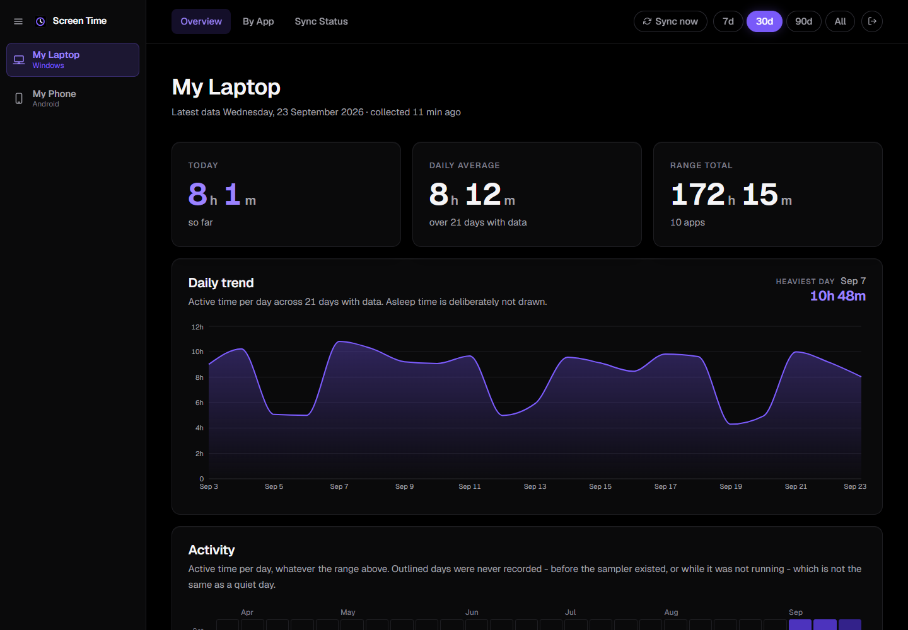

*Screenshots show synthetic data from `npm run demo:seed`.*

- **Local only.** A dashboard on your own PC, reachable from your LAN. No
  cloud, no account, no telemetry, no outbound requests.
- **Real foreground time**, not process uptime. On Windows, a sampler records
  which window has focus and whether the session is locked. On Android, the
  phone's own usage events are reconstructed into sessions and screen-on time.
- **Survives a reset.** The database lives on a non-system drive and is backed
  up with SQLite's `backup()`. A recovery kit and a reset drill prove that a
  wiped `C:\` would cost nothing.
- **Honest numbers.** Every figure was checked against something external,
  such as Android's Digital Wellbeing. The traps found along the way are
  documented in [`CLAUDE.md`](CLAUDE.md).

| By App | A phone |
|---|---|
| 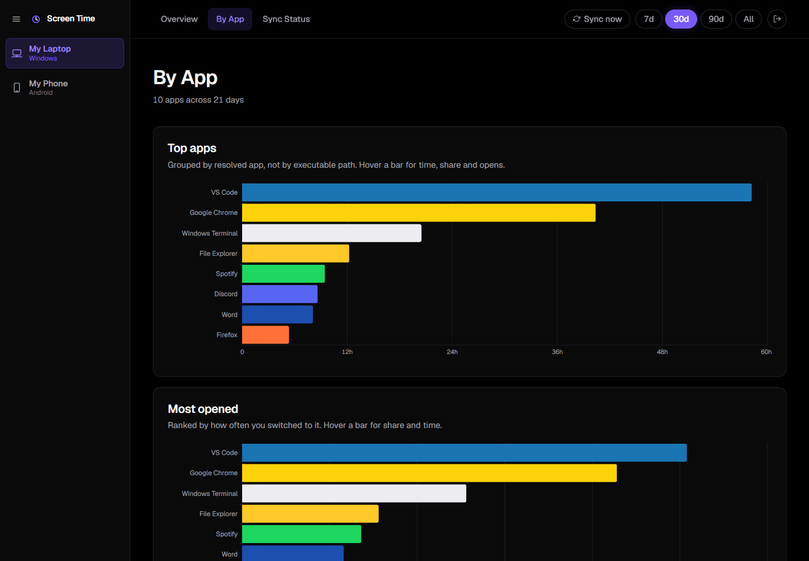 | 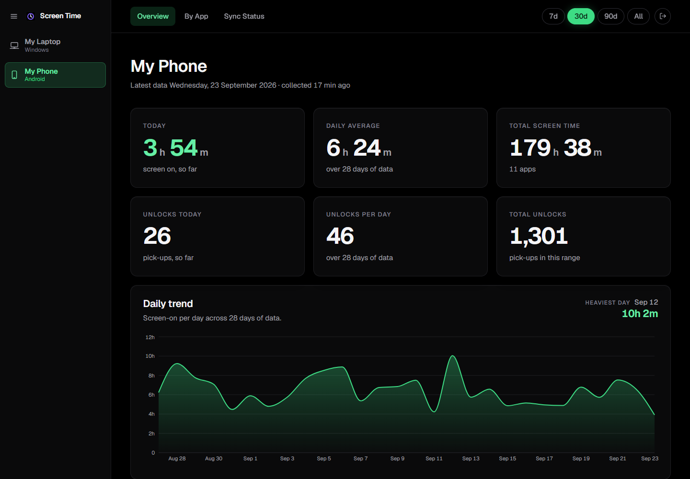 |

## A tour of every page

Full-page screenshots, top to bottom. Click a page to open it.

**The laptop**

<details><summary>Overview: today, the daily trend, a six-month heat map, the shape of the day, and where every minute went</summary>

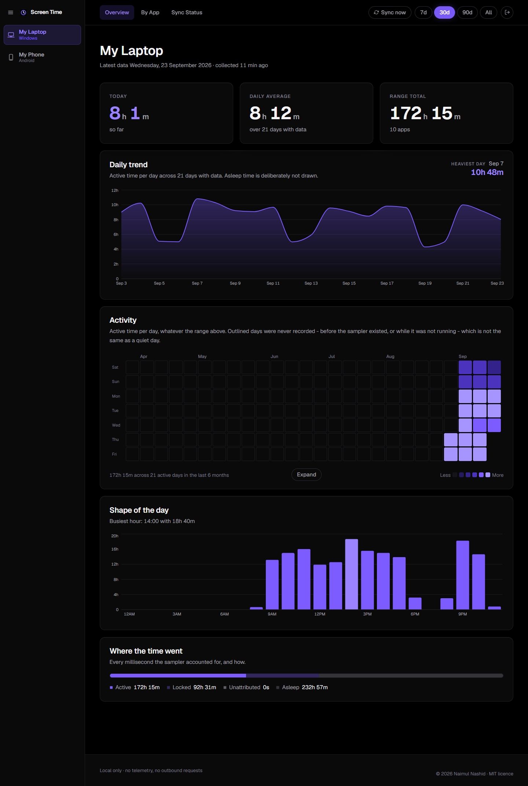
</details>

<details><summary>By App: ranked by time and by opens, in each app's brand colour, above the full app table</summary>

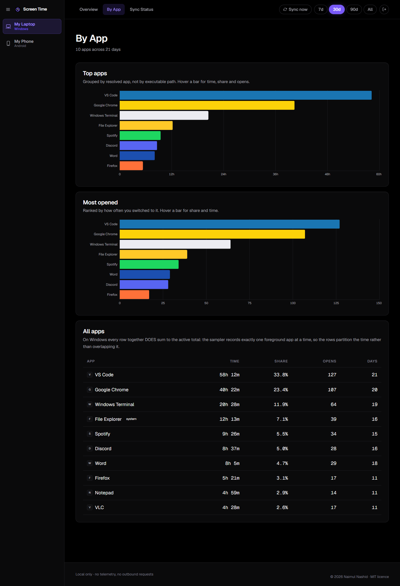
</details>

<details><summary>App detail: one app's total, opens, typical session and longest session, per day and per hour</summary>

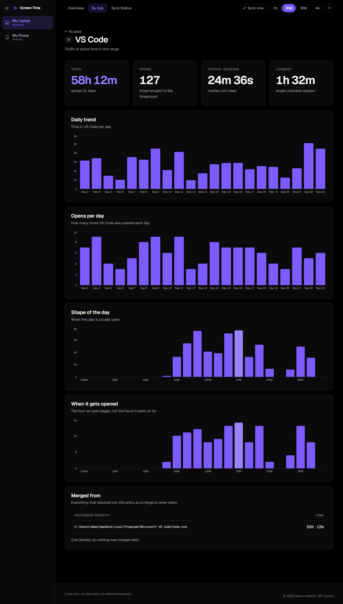
</details>

<details><summary>Activity: the heat map, expanded to every recorded day</summary>

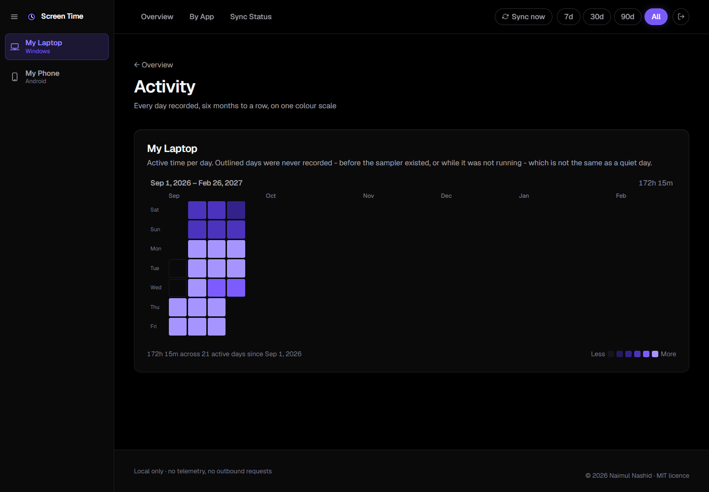
</details>

<details><summary>Sync Status: whether the sampler is running, what is stored, and every ingest run</summary>

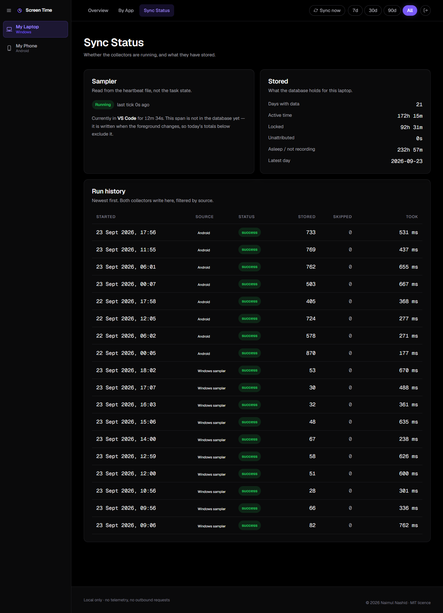
</details>

**A phone**

<details><summary>Overview: screen-on time and unlocks, the trend, the heat map, and how much of it any app accounts for</summary>

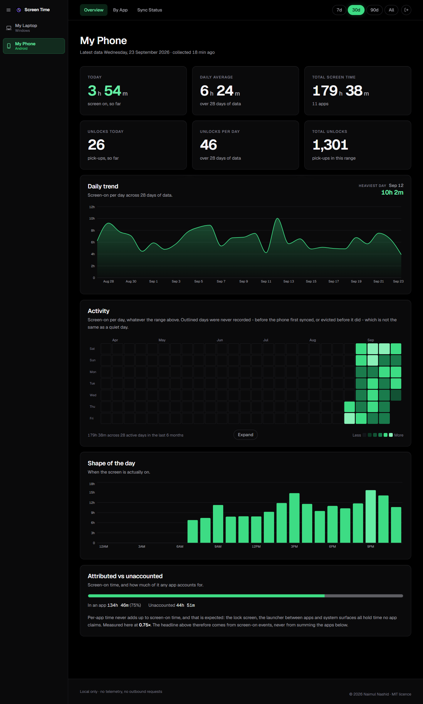
</details>

<details><summary>By App: ranked by time and by opens, above every app the phone reported</summary>

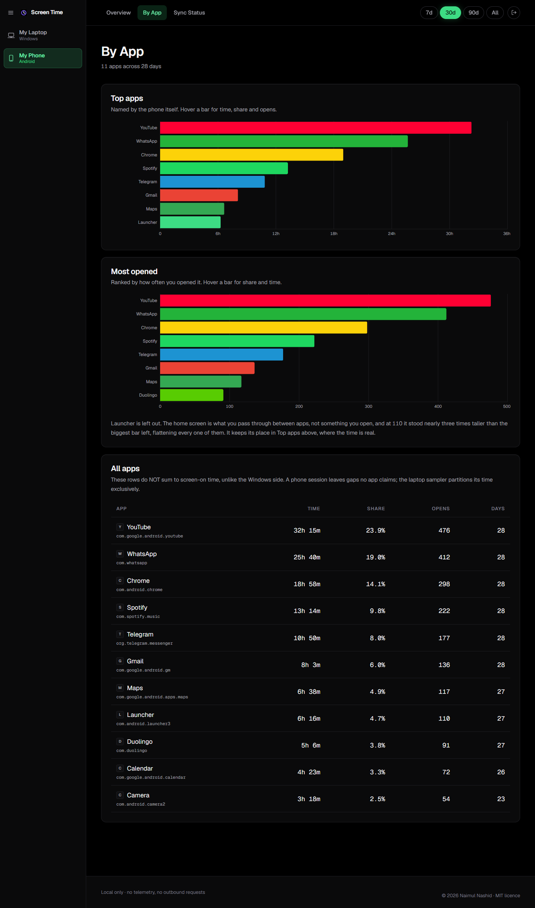
</details>

<details><summary>App detail: one app, per day and per hour</summary>

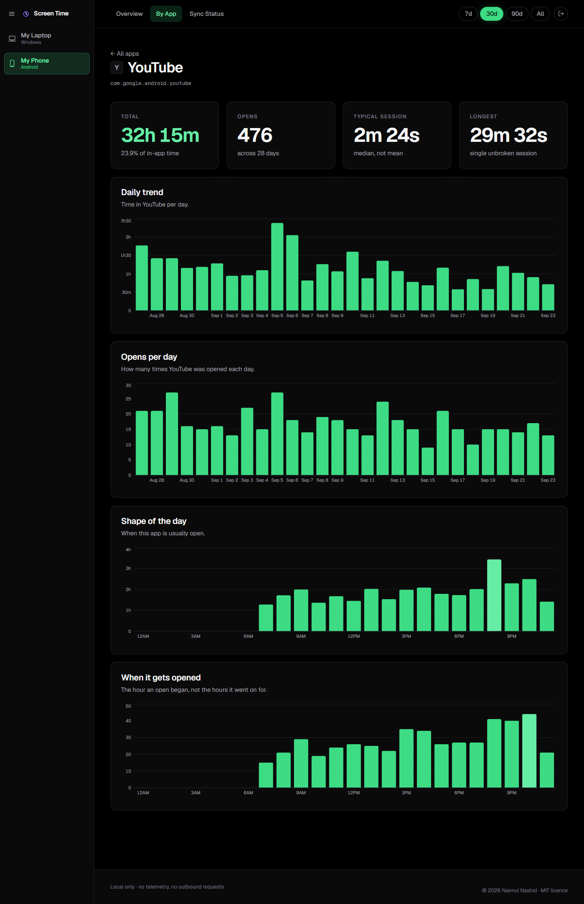
</details>

<details><summary>Activity: the phone's heat map, expanded</summary>

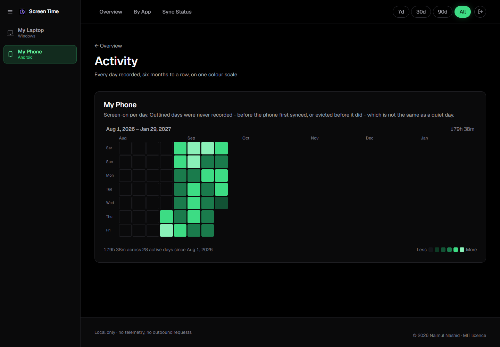
</details>

<details><summary>Sync Status: how far back Android's history reaches, and every push from the phone</summary>

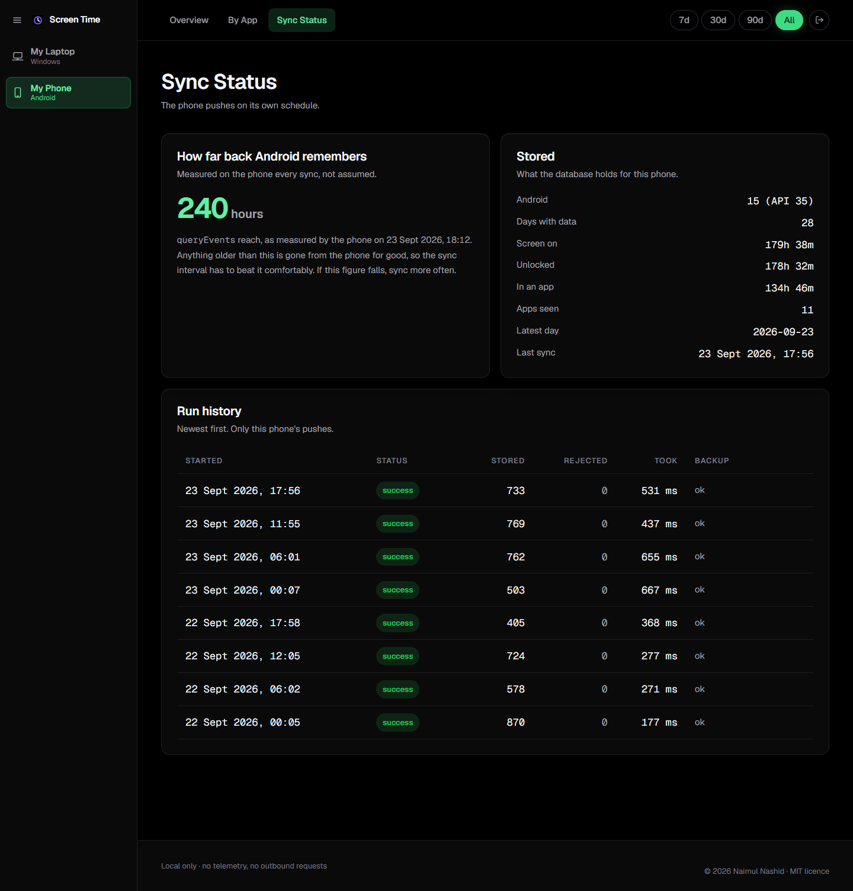
</details>

## How it works

```
 Windows PC                                  Android phone(s)
 ----------                                  ----------------
 sampler.ps1  (logon task, unelevated)       Screen Time Reporter (APK)
   polls the foreground window every 2 s       reads UsageStatsManager events
   -> daily JSONL, crash-safe                   -> gzipped JSON over the LAN,
        |                                          every few hours
        v  hourly task / "Sync now"                  |
 ingest-windows.ts ------------------+     +---------+  POST /api/android/ingest
                                     v     v              (bearer token)
                          SQLite on a NON-system drive
                          + a backup() copy after every write
                                     |
                                     v
                  Next.js dashboard on :7844 (shared password)
```

It is really two different measurements, and the headline figure is computed
differently for each. On Windows the sampler produces an exclusive timeline, so
per-app time adds up to the total. On Android, per-app time adds up to only
about 0.76 of screen-on time, because the lock screen, the launcher and system
surfaces claim the rest. So the phone's headline figure comes from screen-on
events, never from a sum over apps. [`CLAUDE.md`](CLAUDE.md) explains why, with
the measurements.

## Requirements

- **Windows 10 or 11** for the dashboard and the PC collector.
- **Node.js 22.16 or newer**. The project uses Node's built-in `node:sqlite`,
  so there are no native modules to compile.
- **A drive that is not the system drive**, such as `D:\`, for the database.
  The code refuses to put it on `C:\`, since surviving a reset is the point.
- **Optional, for phones:** Android 10 or newer, and JDK 17 or Android Studio
  to build the APK.

## Try it with demo data

```bash
npm ci
cp .env.example .env.local   # set DASHBOARD_PASSWORD to anything
npm run demo:seed            # synthetic laptop + phone, written to demo/
npm run build
npm run demo                 # http://localhost:7849
```

## Setting it up for real

### 1. The dashboard

```bash
npm ci
cp config/collector.example.json config/collector.json
cp .env.example .env.local
```

- In **`config/collector.json`**, point `databasePath`, `backupPath`,
  `scratchDir` and `samplerLogDir` at your non-system drive, and set
  `deviceLabel` to what you call this PC.
- In **`.env.local`**, set `DASHBOARD_PASSWORD` and `ANDROID_INGEST_TOKEN` to
  two different long random values, for example:

  ```bash
  node -e "console.log(require('crypto').randomBytes(24).toString('base64url'))"
  ```

Then build it and run it at every logon:

```bash
npm run build
npm run autostart -- -RunNow
```

It serves on `http://localhost:7844`. The first build takes a minute. After
that, the logon task rebuilds whenever the source is newer than the build.
`start-screen-time-dashboard.bat` and `stop-dashboard.bat` do the same by hand.

### 2. The Windows collector

```bash
powershell -ExecutionPolicy Bypass -File scripts\install-sampler.ps1 -RunNow
```

This registers two unelevated tasks: the sampler, at logon, and the ingest,
hourly. Windows keeps no usable history of foreground time, so recording
starts from the moment the sampler runs.

### 3. A phone (optional)

1. Build the APK:
   ```bash
   cd android
   ./gradlew assembleDebug
   ```
   Then install `app/build/outputs/apk/debug/app-debug.apk`, for example with
   `adb install`. It is sideloaded, not published.
2. In the app, tap **Grant usage access** and enable *Screen Time Reporter*.
3. Enter the dashboard's address (`http://<your-PC's-LAN-IP>:7844`) and
   `ANDROID_INGEST_TOKEN`, then tap **Save and test connection**.

The phone syncs in the background. Android keeps about 10 days of event
history, so the first sync backfills that much.

### 4. Backups

```bash
npm run backup:kit   # the code, the secrets and the local-only files, off C:\
npm run drill        # restore into TEMP, verify, and list anything a reset would lose
npm run restore      # after a reset: bring the database back from the backup
```

Re-run `backup:kit` after changing config, logos or secrets. The drill fails
if the copy is out of date.

### 5. App logos (optional)

No logos ship with the repository: they are other companies' trademarks. Drop
your own into `public/apps_logo/`, and brand colours into
`config/app-colours.json`. Both are gitignored. Until then, every app shows its
initial. See [`public/apps_logo/README.md`](public/apps_logo/README.md).

## Security

The dashboard is **single-user, over plain HTTP on your LAN**. Every page sits
behind one password, which fails closed, and wrong guesses are throttled.
Sessions are signed with a key derived from the password, and the phone uses
its own token. The pages send a strict Content-Security-Policy.

Because it listens on every network interface, run this once from an
**Administrator** shell to block the dashboard on Public networks. Mark your
home network *Private* first, or the phone will be cut off.

```bash
npm run firewall
```

Read [`SECURITY.md`](SECURITY.md) for the threat model and its limits, and for
how to report a vulnerability.

## Accessibility

The pages are built to WCAG 2.1 AA. Contrast is measured, every page has its
own title, every chart has a text summary, and there's a skip link and
screen-reader navigation state. Two deliberate exceptions:

- **Phones get the desktop layout, zoomed to fit**, rather than a reflowed
  narrow one (WCAG 1.4.10). Pinch-zoom still works.
- **The heat map's quietest shades** sit close to the background. The heat map
  has a text summary, and every cell has a title.

## Development

```bash
npm run dev          # dev server on :7844. Stop the logon-task server first:
                     # the two share .next.
npm run typecheck
npm run selftest     # no device or database needed
npm run drill        # the reset drill, against your real backup
```

CI runs the typecheck, the self-test, a production build, a PowerShell 5.1
check and the APK build on every push.

**Before changing anything, read [`CLAUDE.md`](CLAUDE.md).** It is the design
record: every measurement behind a decision, and every trap that was found by
running things rather than by reasoning about them. The day-by-day history is
in [`docs/DEVLOG.md`](docs/DEVLOG.md).
`scripts/research/` holds the measurements that shaped the design. Nothing
there is needed to run the tracker.

This is a personal project. Issues are welcome. For pull requests, please open
an issue first, since the design is deliberately narrow.

## Licence

[MIT](LICENSE) © 2026 Naimul Nashid. App names and logos belong to their
owners. None are distributed here.
